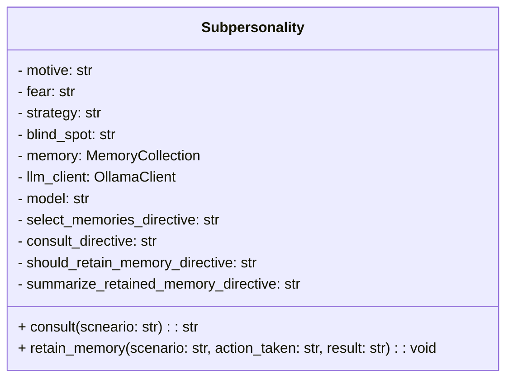
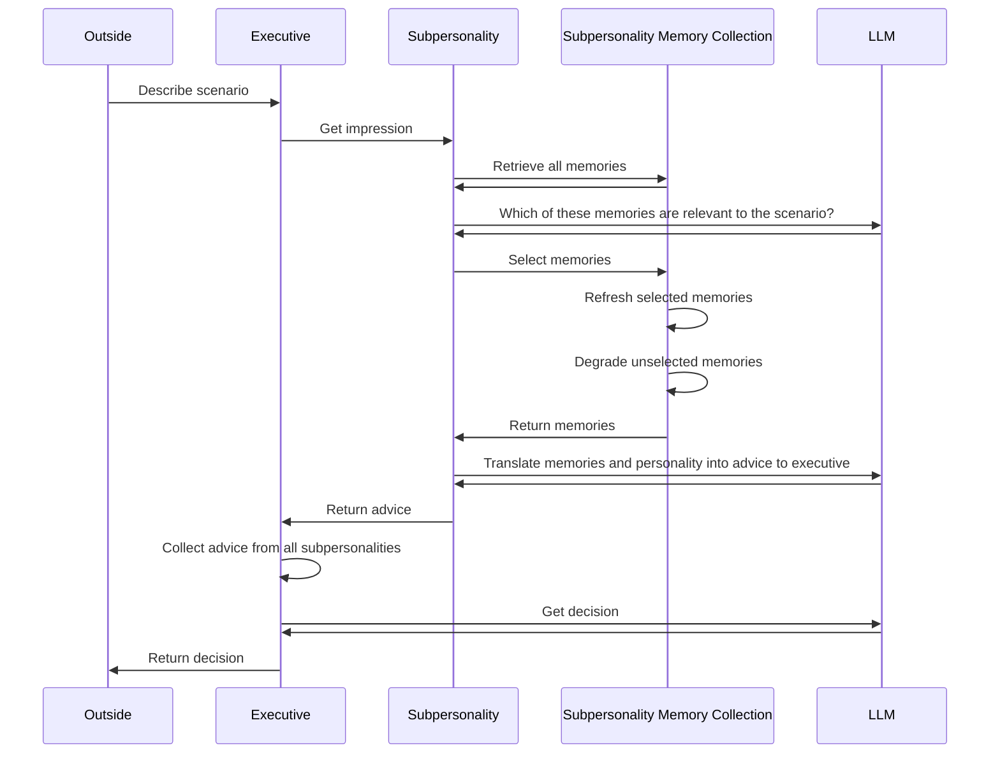
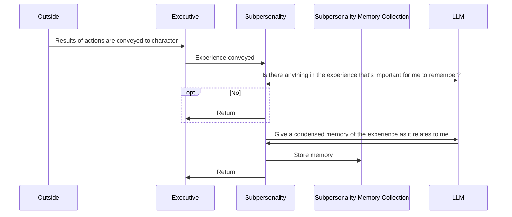

# Design Document
Put current design as well as design aspirations here

## Subpersonality
### Class

- Motive
    - The motive of the subpersonality is its mission statement
        - Keep the host safe
        - Protect the host from heartbreak
        - Be cautious of new people
    - The motive gives the subpersonality direction and a focus area
    - The motive helps give the subpersonality scope in terms of what it needs to deem important
- Fear
    - The fear of the subpersonality is something the subpersonality needs to protect against
        - Injury
        - Heartbreak
        - Ridicule
    - Fear gives the subpersonality an enemy to pit the host against in its advice
- Strategy
    - Strategy defines how the subpersonality intends to accomplish its goals
        - Scan for danger in the environment to limit the actions the host may consider
        - Identify potential romantic partners in the scenario and identify reasons to avoid/neglect them
        - Identify unknowns of people the host is interacting with
    - The strategy frames how the subpersonality should go about approaching given scenarios
- Blind Spot
    - Blind spots prevent the subpersonality from considering advice outside of its scope
        - Misses opportunities and social nuance
        - Ignores cues of interest in potential romantic partners
        - Ignores positive interpretations of the actions of strangers
- Memory
    - A collection of memories the subpersonality has to support its arguments
    - Discussed in further detail laters
- LLM Client
    - How it interacts with llm
    - Model is used here for specific model of llm to consult
- Select Memories Directive
    - Prompt to send to llm to select relevant memories to consider in a scenario
- Consult Directive
    - Prompt to send to llm once memories are gathered
    - The output of the llm should be succinct, actionable advice to the executive on how to proceed in the given scenario
- Should Retain Memory Directive
    - Prompt to send to llm to get a simple yes or no on whether an experience contained anything the subpersonality should consider in the future
- Summarise Retained Memory Directive
    - Prompt to send to llm to extract a concise summary of the memory the subpersonality wishes to retain about the experience
- Consult(Scenario)
    - Method executive calls to retrieve advice from the subpersonality in the given scenario
- Retain Memory(Experience)
    - Conveys an experience of the character to the subpersonality in order for the subpersonality to retain memories
    - Subpersonality provided with scenario, actions taken, and results
### Consult
When prompted for a decision in a scenario, the executive will consult all subpersonalities to reach a decision. Each subpersonality consults its own personal biases and memories to give concise, meaningful advice to the executive.

### Retain Memory
As the character collects experiences, each subpersonality may wish to remember bits and pieces of the experience that relate to them. 

